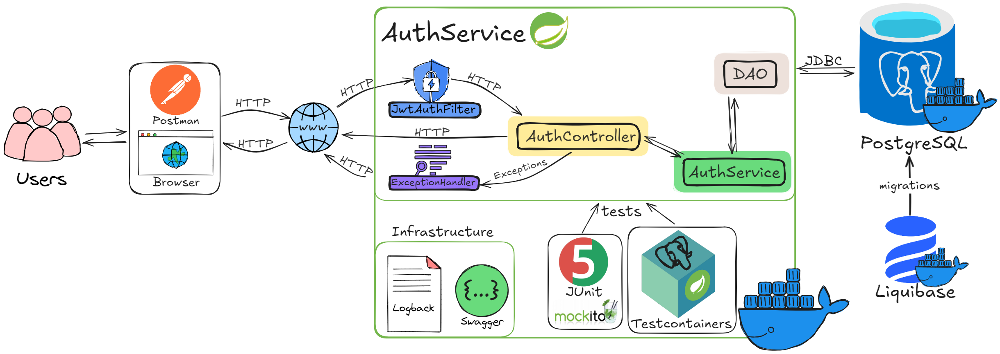

# Сервис авторизации

## Основные возможности
- Регистрация новых пользователей (гость, админ, премиум юзер)
- Авторизация существующих пользователей с token-based подходом
- Повторное получение токена
- Отзыв токена

Для быстрого перехода к инструкции по запуску:
[нажмите сюда](#docker-instructions)

Информация о пользователе включает в себя: 
- Идентификатор,
- Логин (уникальный),
- Пароль (хранится в зашифрованном виде),
- Адрес электронной почты (уникальный)
- Набор ролей

## 📟 Диаграмма компонентов приложения


## Технологический стек
- **Язык программирования**: Java 17
- **Фреймворк**: Spring Boot 3.4
- **База данных**: PostgreSQL
- **ORM**: Hibernate/JPA
- **Безопасность**: Spring Security
- **Сборка**: Maven
- **Тестирование**: JUnit 5, Mockito, TestContainers
- **Документация API**: Swagger/OpenAPI
- **Логирование**: Logback
- **Валидация**: Hibernate Validator
- **Миграции БД**: Liquibase
- **Контейнеризация**: Docker, Docker-compose

## Архитектурные принципы
Проект разработан с соблюдением современных стандартов:
- MVC архитектура
- Принципы SOLID
- Стратегия наследования Hibernate
- Модульная структура пакетов
- Использование DTO для API
- Гибкая система обработки ошибок
- Многоуровневое логирование

<a id="docker-instructions"></a>

## Установка и запуск
### Требования
- Установленный Docker и Docker-compose

### Инструкции по развертыванию
Клонировать репозиторий:
```bash
git clone https://github.com/nemk0ff/AuthService.git
cd AuthService
```
Запустить все сервисы одной командой:

```bash
docker-compose up --build
```
Эта команда автоматически:
- Соберет образ Java-приложения
- Запустит PostgreSQL в отдельном контейнере
- Применит миграции Liquibase
- Запустит само приложение

Приложение будет доступно на: http://localhost:8080

Документация API (Swagger UI): http://localhost:8080/swagger-ui.html

Для остановки проекта:
```bash
docker-compose down
```
## Тестирование
Проект включает:
- Unit-тесты для сервисов и контроллеров
- Интеграционные тесты с TestContainers
- Тестовые данные для проверки функциональности

Запуск тестов: `mvn test`